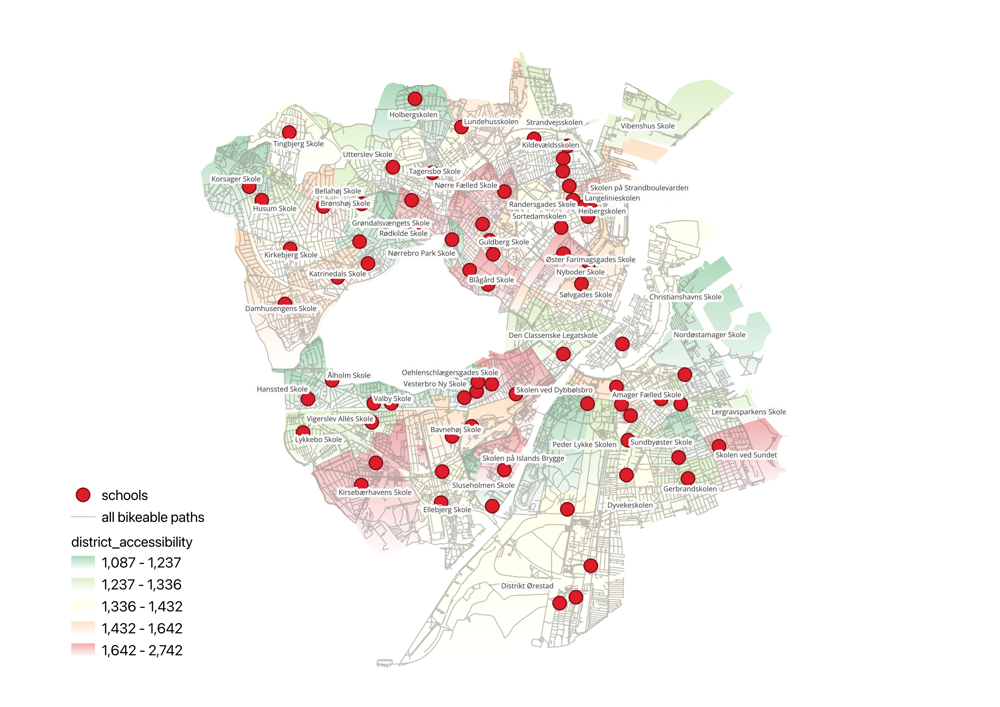

# Safe School Paths for Kids in Copenhagen

This project analyses cycling accessibility to schools in Copenhagen, with a focus on safe routes for children.

The project uses geospatial data, OpenStreetMap data, and network analysis to compare:

- shortest routes to school
- safest routes to school
- spatial differences in accessibility across school districts


*Figure 1: District level cycling accessibility across Copenhagens schools, meassured as the average weighted route distance from residential addresses to their assigned school.*

---

## Project structure

```text
safe-school-paths-cph/
├── notebooks/
├── data/
│   ├── raw/
│   └── processed/
├── README.md
```

## Installation

The environment setup follows the approach used in the course "Geospatial Data Science" at ITU, using Pixi, which is a package management tool.

### 1. Clone the repository

```bash
git clone https://github.com/peterkriegel/safe-bike-paths-to-school-cph.git
cd safe-school-paths-cph
```

### 2. Install Pixi

Follow the instructions about installing Pixi thorugh the installation guide at: https://pixi.prefix.dev/latest/installation/

### 3. Create the Pixi workspace and environment

Place the provided `gds_py.yml` file in the project directory. Then open a terminal in that directory and run:

```bash
pixi init --import gds_py.yml
```

This sets up a Pixi workspace with all required dependencies.

### 4. Install dependencies and start Jupuyter Lab

```bash
pixi run jupyter lab
```

The first time you run this, Pixi will install all dependencies — this may take a few minutes. Afterwards, Jupyter Lab will open automatically in your browser. Pixi will place a `pixi.lock` and `pixi.toml` file in the folder; keep these, as they allow you to restart the environment quickly.

### 5. Test the installation

Run all cells in `test_gdspy_install.ipynb` to verify the environment is set up correctly. Warnings are expected, but as long as the last cell runs without interruption, you are good to go.

## Notebooks

Run the notebooks in the following order:

1. `00_download_osm.ipynb` - Downloads OpenStreetMap data for Copenhagen.
2. `01_prepare_datasets.ipynb` - Cleans and prepares all input datasets.
3. `03_prepare_network.ipynb` - Builds the routable cycling network graph.
4. `04_route_accessibility.ipynb` - Defines accessibility metrics and school catchments.
5. `05_route_compute.ipynb` - Computes the shortest and safest routes for each school.
6. `06_accessibility_analysis.ipynb` - Analyses and visualises spatial differences in accessibility.

### Optional

Running the following notebooks are optional:

7. `02_voronoi_school_allocation_visualisation.ipynb` - Visualises Voronoi-based school district allocations.

---

## Data

All datasets used in the project are included in the repository.

- `data/raw/` contains original datasets from Copenhagen Municipality
- `data/processed/` contains processed layers and final results

### Dataset desciptions

| File | Source | Description |
|---|---|---|
| `distriktsskoler_09032026.gpkg` | Københavns Kommune (KK) | GeoPackage of district school locations in Copenhagen as of March 2026. Loaded in `01_prepare_datasets.ipynb` and used as the primary school destination layer throughout the route analysis. |
| `specialskoler_09032026.gpkg` | Københavns Kommune (KK) | GeoPackage of special schools in Copenhagen as of March 2026. Loaded in `01_prepare_datasets.ipynb` and merged with district schools to form the complete school dataset used in the analysis. |
| `Adresser til brug af skoledistrikter i KK 2026_02_19.xlsx` | Københavns Kommune (KK) | Address-level data linking residential addresses to school district numbers and names (`Skoledistriktsnr`, `Skoledistriktsnavn`). Used in `01_prepare_datasets.ipynb` to geocode origin points and in `04_route_accessibility.ipynb` to allocate addresses to their assigned school. |
| `skolegrunddistrikt_kk_marts2026/` | Københavns Kommune (KK) | Shapefile folder containing official school catchment district polygons (grunddistrikter) from KK, March 2026. Used in `01_prepare_datasets.ipynb` as the authoritative district boundary layer, replacing approximate convex hull polygons. Also used in `03_prepare_network.ipynb` to define the study area boundary for the OSM network download. |
| OpenStreetMap cycling network | OpenStreetMap via OSMnx | The cycling network for Copenhagen Municipality, downloaded programmatically in `00_download_osm.ipynb` using OSMnx and saved as a GraphML file. A weighted version (`cph_bike_network_weighted.graphml`) is created in `03_prepare_network.ipynb` for safe-route calculations and used in `05_route_compute.ipynb` for all routing. |

### Data sources in detail

 Dataset | Obtained from | Date |
|---|---|---|
| School districts (`skolegrunddistrikt_kk_marts2026/`) | Klima-, Miljø- og Teknikforvaltningen, Københavns Kommune (direct request) | 9 March 2026 |
| District schools (`distriktsskoler_09032026.gpkg`) | Klima-, Miljø- og Teknikforvaltningen, Københavns Kommune (direct request) | 9 March 2026 |
| Special schools (`specialskoler_09032026.gpkg`) | Klima-, Miljø- og Teknikforvaltningen, Københavns Kommune (direct request) | 9 March 2026 |
| Addresses (`Adresser til brug af skoledistrikter i KK 2026_02_19.xlsx`) | Børne- og Ungdomsforvaltningen, Københavns Kommune (direct request) | 19 February 2026 |
| Cycling network | OpenStreetMap contributors, downloaded via OSMnx |

---

## Author

**Peter Kriegel**  
IT University of Copenhagen

- Email: Peterkriegel94@gmail.com and pkri@itu.dk
- GitHub: github.com/peterkriegel and github.com/pkri
- Linkedin: linkedin.com/peterkriegel

## Acknowledgements

- Envirnomnent setup follows the approach from the Geospatial Data Science course at the IT University and the course manager and professors from the course (Michael Szell, Altea Fogh, Anastassia Vybornova and Manuel Knepper).
- Thank you to Copenhagen Municipality for helping me retreieving the different datasets.
- A huge thanks to my supervisor Anastassia Vybornova for her many hours of supervision, help and moral support through the project.
